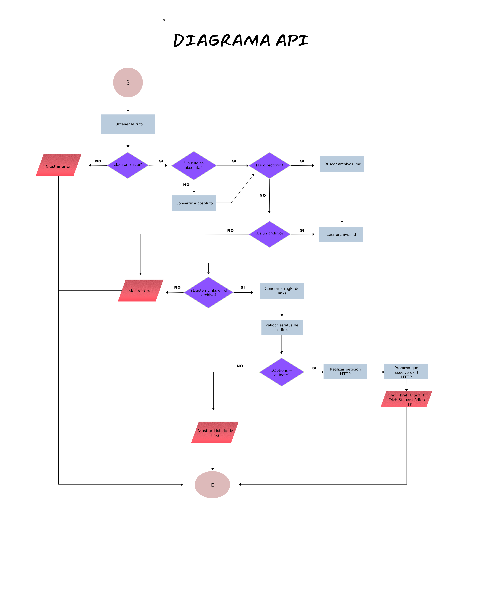
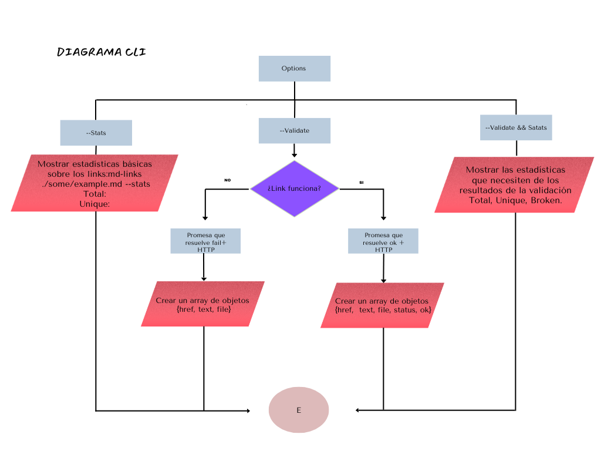

# Markdown Links

## Índice


* [1. Preámbulo](#1-preámbulo)
* [2. Instalación](#2-Instalación)
* [3. Detalles técnicos](#3-Detalles-técnicos)
* [4. Guía de uso](#4-Guía-de-uso)


***

## 1.Preámbulo

[Markdown] es un lenguaje de marcado que facilita la aplicación de formato a un texto empleando una serie de caracteres de una forma especial. Nos permite buscar, dada una ruta, los archivos `.md` y extraer los links que contenga cada uno de ellos. Si se desea, se verifica el estado de los links y se dan algunas estadísticas de los datos encontrados.


## 2. Instalación


## 3. Detalles técnicos

MD-LINKS esta compuesto en dos partes: La librería y el script ejecutable (herramienta de línea de comando - CLI).

Esta construido en `JavaScript` para ser ejecutado con `Node.js`
Recibe tanto rutas relativas como absolutas.
Tiene soporte para archivos y carpetas.

A demás de traer los links nos permite obtener estadísticas opcionales como:
- Total de links de los archivos o directorios analizados.
- Links no repetidos.
- Links funcionales (cuya petición http fue exitosa).

*Diagramas de flujos*




## 4. Guía de uso


### 1) JavaScript API

El módulo debe poder **importarse** en otros scripts de Node.js y debe ofrecer la
siguiente interfaz:

#### `mdLinks(path, options)`

##### Argumentos

* `path`: Ruta **absoluta** o **relativa** al **archivo** o **directorio**.
* `options`: Un objeto con **únicamente** la siguientes propiedad:
  - `validate`: Booleano que determina si se desea validar los links
    encontrados.
    
##### Valor de retorno

La función debe **retornar una promesa** (`Promise`) que **resuelva a un arreglo**
(`Array`) de objetos (`Object`), donde cada objeto representa un link y contiene
las siguientes propiedades

Con `validate:false` :

* `href`: URL encontrada.
* `text`: Texto que aparecía dentro del link (`<a>`).
* `file`: Ruta del archivo donde se encontró el link.

Con `validate:true` :

* `href`: URL encontrada.
* `text`: Texto que aparecía dentro del link (`<a>`).
* `file`: Ruta del archivo donde se encontró el link.
* `status`: Código de respuesta HTTP.
* `ok`: Mensaje `fail` en caso de fallo u `ok` en caso de éxito.

#### Ejemplo (resultados como comentarios)

```js
const mdLinks = require("md-links");

mdLinks("./some/example.md")
  .then(links => {
    // => [{ href, text, file }, ...]
  })
  .catch(console.error);

mdLinks("./some/example.md", { validate: true })
  .then(links => {
    // => [{ href, text, file, status, ok }, ...]
  })
  .catch(console.error);

mdLinks("./some/dir")
  .then(links => {
    // => [{ href, text, file }, ...]
  })
  .catch(console.error);
```

### 2) CLI (Command Line Interface - Interfaz de Línea de Comando)

El ejecutable de nuestra aplicación debe poder ejecutarse de la siguiente
manera a través de la **terminal**:

`md-links <path-to-file> [options]`

Por ejemplo:

```sh
$ md-links ./some/example.md
./some/example.md http://algo.com/2/3/ Link a algo
./some/example.md https://otra-cosa.net/algun-doc.html algún doc
./some/example.md http://google.com/ Google
```

El comportamiento por defecto no debe validar si las URLs responden ok o no,
solo debe identificar el archivo markdown (a partir de la ruta que recibe como
argumento), analizar el archivo Markdown e imprimir los links que vaya
encontrando, junto con la ruta del archivo donde aparece y el texto
que hay dentro del link (truncado a 50 caracteres).

#### Options

##### `--validate`

Si pasamos la opción `--validate`, el módulo debe hacer una petición HTTP para
averiguar si el link funciona o no. Si el link resulta en una redirección a una
URL que responde ok, entonces consideraremos el link como ok.

Por ejemplo:

```sh
$ md-links ./some/example.md --validate
./some/example.md http://algo.com/2/3/ ok 200 Link a algo
./some/example.md https://otra-cosa.net/algun-doc.html fail 404 algún doc
./some/example.md http://google.com/ ok 301 Google
```

Vemos que el _output_ en este caso incluye la palabra `ok` o `fail` después de
la URL, así como el status de la respuesta recibida a la petición HTTP a dicha
URL.

##### `--stats`

Si pasamos la opción `--stats` el output (salida) será un texto con estadísticas
básicas sobre los links.

```sh
$ md-links ./some/example.md --stats
Total: 3
Unique: 3
```

También podemos combinar `--stats` y `--validate` para obtener estadísticas que
necesiten de los resultados de la validación.

```sh
$ md-links ./some/example.md --stats --validate
Total: 3
Unique: 3
Broken: 1
```